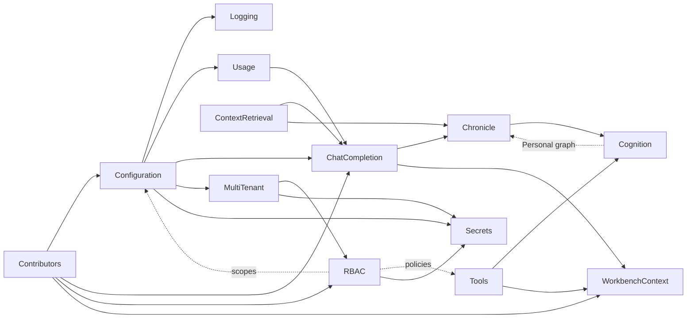

```mermaid
graph LR
  Contributors --> Configuration
  Configuration --> Logging
  Configuration --> Usage
  Contributors --> Chat[ChatCompletion]
  Configuration --> Chat
  Usage --> Chat
  Retrieval[ContextRetrieval] --> Chat
  Retrieval --> Chronicle
  Chat --> Chronicle
  Chronicle --> Cognition
  Tools --> Cognition
  Configuration --> MultiTenant
  MultiTenant --> RBAC
  Contributors --> RBAC
  RBAC -. scopes .-> Configuration
  RBAC -. policies .-> Tools
  Cognition -. Personal graph .-> Chronicle
  Contributors --> Workbench[WorkbenchContext]
  Chat --> Workbench
  Tools --> Workbench
  Configuration --> Secrets
  MultiTenant --> Secrets
  RBAC --> Secrets
```
